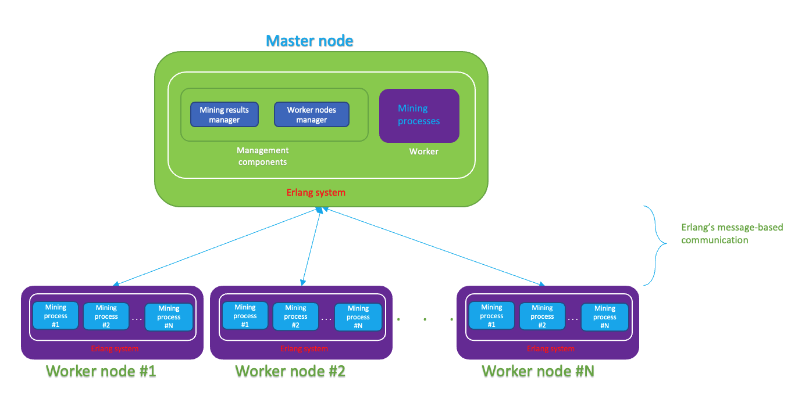

# Coin Miner
Distributed Operating System Principles Project 1 - University of Florida - Fall 2022.


### Project Members
* Suriyan Subbarayan
* Shreya Shah


### Problem Statement
Generate N hash strings with k prefixed zeroes using a random input string.
This should be done using actor model and in a distributed way.

For eg; k = 2, N = 2
k = No. of zeroes needed in the prefixed hash string
N = Total no. of hash strings required

Random Input String | Hash
--- | ---
"shah.shreya;C4+v4DE13RA=" | "00de1878ee7d5ea74d6e5506453284f862208fdf876192c0d2b50d42d606060b"
"suriyan.subbaray;W96JefS2hFE=" | "0078570af003933dfbb25f2d4bcef75485285f45e807a59985d7abefe81df947"

### How to run the code:
On local machine:
1. Change directory to ./coin-miner/master/src/
2. Open an erlang shell with:
  `erl -name Node1 -setcookie cookie1`
3. In the erlang shell, compile worker, master and run **master**
    ```
    (Node1@saturn)6> c('./../../worker/src/worker').
    {ok,worker}
    (Node1@saturn)7> c(master).
    {ok,master}
    (Node1@saturn)8> master:start(2, 2, 'master_connect', 'Node1@saturn').
    % Fourth arg is Node name shown on left most side of the command.
    ```
4. Open another erlang shell, compile worker, run **worker**
   ```
   erl -name Worker1 -setcookie cookie1
   work1@saturn)1> c(worker).
   {ok,worker}
   (work1@saturn)2> worker:start('master_connect', 'Node1@saturn').
   ```

For running on different systems, the erlang shell name should look like anything@youripaddress.


### Project Details and Architecture
There are two programs - master.erl and worker.erl

**- Worker**
* Worker does the job allocated by master to find a certain number of hash strings
with k zeroes in the prefix.
* While doing the job whenever worker finds a matching hash, it sends the result to the master.
* Once the allocated job is finished, worker notifies the master.
* If there is more work, the master allocates another job.
* Otherwise the worker kills its processes and stays connected to master (i.e. is present in the workers' list maintained by the master) to get more work in future.


**- Master**
* Master's responsiblities include allocating workers with a job, accumulate results sent by workers and handle termination once work is done.
* Master is also a worker itself. So master program can work standalone and generate the results.
* Once the total required hash strings N are returned, master will send a shutdown signal to all of the workers and then terminate itself.

Example: Input -> k = 4, N = 9
Master is going to assign worker a job to find 5 strings (MAX_WORK that can be allocated to a worker). And 4 hash strings to another worker that joined.
- MAX_WORK (Maximum work that can be allocated to a work) is a variable that is set to 5. This helps us to divide the total work in batches and finish in it parallel on different connected workers.

Things you can tweak in the code to get different results:
* MAX_WORK - Maximum work allocated to a worker.
* Process_count - No of processes a single worker will spawn to get the result. One can increase the process count depending upon the machine's capacity.




### Sample Mined Coins:

Random Input String | Hash
--- | ---
"suriyan.subbaray;37wmp8bs8+k=" | "00000fc4efa78a79be76f914eb824a54d7b7376c0d176ce24fe437427deb59d2"
"suriyan.subbaray;dVptSprWzUc=" | "00000720505ddeab4a8d33e0771c1faba47d90adb1d095e314f89fc6158ea8fa"
"suriyan.subbaray;tMETOhN3TDI=" | "000005fc696180ac17b9e4bc01736150cdd57ca8bbb78b6d0b65830788c12a6b"
"suriyan.subbaray;Z+hrHc9ceKk=" | "00000122a16e81cbe0493a673301fa02063cb6e0d79641c1b046a6f2ba4c737b"
"suriyan.subbaray;le+84X7etfw=" | "00000046b6b6d3b92e5cbc1db5cfd8e67e45c8d95fe0d5bb0f51f2fe0419275a"
"shah.shreya;s4m8N4QHhDw=" | "000000b2707ffebf84938ceb11842a121d65588899afeb61b4bca20ccab7d7da"
"shah.shreya;+8VBk6hRNhY=" | "000000152d28b810c1eed1d3c86f6b734ab446a01ebf6ee0f1ada5c21d6b8d74"
"suriyan.subbaray;HTwYr00LqhY=" | "000000a2798a5935b0dfdeca014cae2e8c6a980159caa4688d66fee67df403e2"


### Result for k = 4 (Hash String with 4 zeroes as prefix)

##### Master Machine Configuration:
* Processor: Apple M1 Pro
* Cores: 8
* CPU Time for worker running on master: 12939 ms
* Realtime for worker running on master: 5857 ms
* CPU-Realtime ratio: 2.209151442718115

##### Remote machine Worker Configuration:
* Processor: AMD Ryzen 9 5900HX
* Cores: 8
* CPU Time for worker running on master: 56410 ms
* Realtime for worker running on master: 5911 ms
* CPU-Realtime ratio: 9.543224496701066 ms


### Largest numbers of machines the code was run with: 2

### Choosing Work unit size to get better performance:
Master allocates the work in batches. Work unit size is defined as MAX_WORK in the code. 
We experimented with various work unit sizes. After checking the results for values 5 and 10 string results in a batch, the results were different for both the remote and master machine. Check the result with different input values below. 
We kept the process count constant to check with different work unit size to see the effect on performance. 

There is a minor difference in CPU-to-Realtime ratio for Macbook Pro Machine but for work unit size of 5 and 10 while keeping the Process_count constant, the performance of AMD Ryzen 9 machine seems to be better for Work unit size of 10 as CPU-to-Realtime ratio increased.

### Results for different input values

K | N | MAX_WORK | Process_Count | CPU Ratio for Master's Worker | CPU Ratio for remote Worker
--- | --- | --- | --- | --- | ---
4 | 100 | 10 | 15 | 2.21 | 9.54
5 | 50 | 5 | 15 | 2.24 | 11.27
6 | 30 | 5 | 15 | 2.23 | 11.65
6 | 30 | 10 | 15 | 2.20 | 12.45

### Highest zero coins mined

#### 7 zeroes
Random Input String | Hash
--- | ---
"suriyan.subbaray;Y7JwdMBO88E=" | "0000000e8621690851616913d794a0d938aa87dbcea13d45cb91422d66d519ed"
"shah.shreya;SFA86zq8QAQ=" | "00000004028ffdc8ea33186610995574334a49f67df97426385e640d9caa257c"

#### 8 zeroes
Random Input String | Hash
--- | ---
"suriyan.subbaray;9zsCqHEvAQY=" | "00000000333cc99f096719e807e542577ef671cae8a990e1d69f6dcb11a81acf"
"shah.shreya;ANa5XMS2BCE=" | "00000000f708dc3dffdf091e47fd49c8cd356cba397d657be52ed2b17d20c600"